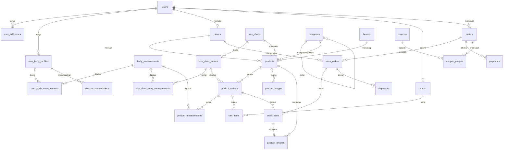

# FitMate — Dokumentasi Migration & Rencana Model

Dokumentasi skema database FitMate: marketplace fashion multi-seller dengan standar ukuran terpusat.

**Status:** 28 migration, semua sudah dijalankan dan lolos `php artisan migrate`.
**Database:** SQLite (dev) · **Laravel:** 13.24 · **PHP:** 8.4

---

## Daftar Isi

1. [Keputusan Desain](#1-keputusan-desain)
2. [Peta Relasi](#2-peta-relasi)
3. [Urutan Migration](#3-urutan-migration)
4. [Rincian Tabel](#4-rincian-tabel)
5. [Cara Kerja Rekomendasi Ukuran](#5-cara-kerja-rekomendasi-ukuran)
6. [Model yang Perlu Disiapkan](#6-model-yang-perlu-disiapkan)
7. [Enum yang Perlu Dibuat](#7-enum-yang-perlu-dibuat)
8. [Factory & Seeder](#8-factory--seeder)
9. [Catatan Konvensi](#9-catatan-konvensi)

---

## 1. Keputusan Desain

Empat keputusan yang membentuk seluruh skema ini:

| Keputusan | Pilihan | Konsekuensi di skema |
|---|---|---|
| Kepemilikan standar ukuran | **Global, satu standar FitMate** | `size_charts` tidak punya `store_id` maupun `brand_id` |
| Siapa yang boleh mengubah | **Hanya admin** | Ditegakkan di Policy, bukan di skema — lihat [catatan](#9-catatan-konvensi) |
| Pembeda chart | **Per gender saja** (tanpa region) | `unique(['size_type', 'gender'])` di `size_charts` |
| Penyimpanan angka ukuran | **Kamus dimensi (EAV)** | `body_measurements` jadi sumber kebenaran tunggal |

### Kenapa satu standar global

Nilai jual FitMate adalah: user mengisi ukuran badan **sekali**, hasilnya berlaku di **semua toko**. Kalau tiap seller boleh mendefinisikan "XL" versi sendiri, janji itu batal.

Keputusan ini dikunci di level database lewat `unique(['size_type', 'gender'])` pada `size_charts` — secara struktural tidak mungkin ada dua definisi "Atasan Pria" yang bersaing.

Seller **memilih** entry ukuran yang sudah ada (`product_variants.size_chart_entry_id`), bukan mengetik teks bebas. Tidak ada jalan bagi seller untuk menyimpang dari standar.

### Kenapa kamus dimensi (EAV)

Dimensi ukur disimpan sebagai baris di `body_measurements`, bukan sebagai kolom. Tiga keuntungannya:

- Admin bisa menambah dimensi baru (misal `lingkar_kepala` untuk topi) lewat panel admin, **tanpa migration baru**
- Chart baju tidak menyeret kolom kosong milik sepatu
- Sisi user dan sisi chart memakai kamus yang **sama**, sehingga perbandingannya jadi join biasa — lihat [bagian 5](#5-cara-kerja-rekomendasi-ukuran)

---

## 2. Peta Relasi



---

## 3. Urutan Migration

Urutan timestamp menentukan urutan foreign key. Jangan diubah tanpa mengecek dependensinya.

| Timestamp | Tabel | Bergantung pada |
|---|---|---|
| `0001_01_01_000000` | `users`, `password_reset_tokens`, `sessions` | — |
| `0001_01_01_000001` | `cache` | — |
| `0001_01_01_000002` | `jobs` | — |
| `2026_08_10_130407` | `personal_access_tokens` | — |
| `2026_08_11_035837` | `user_addresses` | users |
| `2026_08_11_040614` | `user_body_profiles` | users |
| `2026_08_11_042700` | `stores` | users |
| `2026_08_11_042813` | `categories` | categories (self) |
| `2026_08_11_042825` | `brands` | — |
| `2026_08_11_042838` | `coupons` | stores |
| `2026_08_11_042855` | `banner_promos` | — |
| `2026_08_11_050000` | `body_measurements` | — |
| `2026_08_11_050100` | `user_body_measurements` | user_body_profiles, body_measurements |
| `2026_08_11_050200` | `size_charts` | — |
| `2026_08_11_050300` | `size_chart_entries` | size_charts |
| `2026_08_11_050400` | `size_chart_entry_measurements` | size_chart_entries, body_measurements |
| `2026_08_11_050500` | `products` | stores, categories, brands, size_charts |
| `2026_08_11_050600` | `product_variants` | products, size_chart_entries |
| `2026_08_11_050700` | `product_images` | products |
| `2026_08_11_050800` | `product_measurements` | product_variants, body_measurements |
| `2026_08_11_050900` | `size_recommendations` | user_body_profiles, size_charts, size_chart_entries, products |
| `2026_08_11_051000` | `carts` | users |
| `2026_08_11_051100` | `cart_items` | carts, product_variants |
| `2026_08_11_051200` | `wishlists` | users, products |
| `2026_08_11_051300` | `orders` | users, coupons |
| `2026_08_11_051400` | `store_orders` | orders, stores |
| `2026_08_11_051500` | `order_items` | store_orders, products, product_variants |
| `2026_08_11_051600` | `payments` | orders |
| `2026_08_11_051700` | `shipments` | store_orders |
| `2026_08_11_051800` | `product_reviews` | products, users, order_items |
| `2026_08_11_051900` | `coupon_usages` | coupons, users, orders |

> **Catatan:** `stores` sengaja diberi timestamp `042700` (lebih awal dari `categories`) karena `coupons` di `042838` punya foreign key ke `stores`.

---

## 4. Rincian Tabel

### 4.1 Pengguna

#### `users`

Satu tabel untuk semua peran. Dibedakan lewat kolom `role`.

| Kolom | Tipe | Catatan |
|---|---|---|
| `name`, `email`, `password` | string | `email` unique |
| `phone_number`, `profile_picture` | string nullable | |
| `gender` | enum | `male`, `female` — nullable |
| `role` | enum | `user`, `seller`, `customerservice`, `admin`, `superadmin` — default `user` |
| `status` | enum | `active`, `inactive` — default `active` |

#### `user_addresses`

Alamat pengiriman. Satu user boleh punya banyak, satu ditandai `is_default`.

| Kolom | Tipe | Catatan |
|---|---|---|
| `user_id` | FK → users | cascade |
| `label` | string | "Home", "Work", "Other" — default `Home` |
| `recipient_name`, `recipient_phone` | string | penerima bisa beda dari pemilik akun |
| `street` | text | |
| `city`, `state`, `postal_code`, `country` | string | |
| `is_default` | boolean | default `false` |

#### `user_body_profiles`

Identitas profil ukuran. **Angkanya tidak di sini** — ada di `user_body_measurements`.

Satu user boleh punya beberapa profil ("Profil Saya", "Pasangan", "Adik"), jadi bisa belanjakan orang lain tanpa mengganti data sendiri.

| Kolom | Tipe | Catatan |
|---|---|---|
| `user_id` | FK → users | cascade |
| `profile_name` | string | default `Profil Saya` |
| `gender` | enum nullable | `male`, `female` — dipakai memilih `size_charts` yang cocok |
| `is_default` | boolean | profil yang dipakai kalau user tidak memilih |

#### `user_body_measurements`

Angka ukuran badan, satu baris per dimensi.

| Kolom | Tipe | Catatan |
|---|---|---|
| `user_body_profile_id` | FK | cascade |
| `body_measurement_id` | FK | cascade |
| `value` | decimal(6,2) | satuannya ikut `body_measurements.unit` |

**Unique:** `(user_body_profile_id, body_measurement_id)` — nama index `user_body_measurement_unique`

---

### 4.2 Mesin Ukuran

Inilah bagian yang membedakan FitMate dari e-commerce biasa.

#### `body_measurements` — kamus dimensi

Sumber kebenaran tunggal. Dipakai bersama oleh tiga pihak: ukuran badan user, rentang standar FitMate, dan ukuran asli produk.

| Kolom | Tipe | Catatan |
|---|---|---|
| `key` | string unique | `lingkar_dada`, `panjang_telapak_kaki` |
| `label` | string | "Lingkar Dada" — untuk tampilan |
| `description` | string nullable | panduan cara mengukur untuk user |
| `unit` | string(10) | default `cm`, bisa `kg` |
| `applies_to` | enum | `general`, `top`, `bottom`, `footwear` |
| `sort_order` | smallint | urutan tampil di form |
| `is_active` | boolean | default `true` |

`general` dipakai untuk tinggi dan berat badan yang relevan di semua perhitungan.

#### `size_charts` — standar resmi FitMate

Hanya admin yang boleh membuat atau mengubah. Toko tidak punya chart sendiri.

| Kolom | Tipe | Catatan |
|---|---|---|
| `name` | string | "Atasan Pria", "Alas Kaki Unisex" |
| `slug` | string unique | |
| `size_type` | enum | `top`, `bottom`, `footwear` |
| `gender` | enum | `male`, `female`, `unisex` — default `unisex` |
| `description` | text nullable | |
| `is_active` | boolean | default `true` |

**Unique:** `(size_type, gender)` — **ini yang mengunci "satu standar global"**

#### `size_chart_entries` — label ukuran

| Kolom | Tipe | Catatan |
|---|---|---|
| `size_chart_id` | FK | cascade |
| `label` | string(20) | `S`, `M`, `XL`, atau `42` untuk alas kaki |
| `sort_order` | smallint | agar XS < S < M < L < XL urut benar |
| `is_active` | boolean | default `true` |

**Unique:** `(size_chart_id, label)`

#### `size_chart_entry_measurements` — jawaban "XL itu berapa?"

Tabel inti standarisasi.

| Kolom | Tipe | Catatan |
|---|---|---|
| `size_chart_entry_id` | FK | cascade |
| `body_measurement_id` | FK | cascade |
| `min_value` | decimal(6,2) | |
| `max_value` | decimal(6,2) | |

**Unique:** `(size_chart_entry_id, body_measurement_id)` — nama index `size_entry_measurement_unique`

Contoh baris: entry `XL` + dimensi `lingkar_dada` → min `104.00`, max `108.00`.

#### `size_recommendations` — cache hasil hitung

Disimpan agar tidak menghitung ulang tiap kali membuka produk, sekaligus jadi data analitik.

| Kolom | Tipe | Catatan |
|---|---|---|
| `user_body_profile_id` | FK | cascade |
| `size_chart_id` | FK | cascade |
| `size_chart_entry_id` | FK nullable | **hasilnya**, misal XL. `set null` |
| `product_id` | FK nullable | null = rekomendasi umum per chart; terisi = khusus produk |
| `fit_status` | enum | `tight`, `fit`, `loose` |
| `fit_score` | decimal(5,2) | 0–100, tingkat keyakinan |
| `matched_measurements` | tinyint | dimensi yang masuk rentang |
| `total_measurements` | tinyint | dimensi yang dibandingkan |
| `computed_at` | timestamp nullable | |

**Unique:** `(user_body_profile_id, size_chart_id, product_id)` — nama index `size_recommendation_unique`

---

### 4.3 Katalog

#### `categories`

Bertingkat lewat `parent_id`: Pakaian → Kaos, Alas Kaki → Sandal.

| Kolom | Tipe | Catatan |
|---|---|---|
| `parent_id` | FK → categories nullable | cascade |
| `name`, `slug` | string | `slug` unique |
| `type` | enum | `clothing`, `footwear`, `accessories` |
| `size_type` | enum | `top`, `bottom`, `footwear`, `none` — default `none` |
| `description`, `icon` | string nullable | |
| `sort_order`, `is_active` | | |

**`size_type` adalah penghubung ke mesin ukuran.** Nilai `none` dipakai topi, kacamata, jam tangan, dan kalung — produk di kategori itu otomatis lewat dari perhitungan.

Pemetaan produk yang dijual:

| Produk | `type` | `size_type` | Ikut perhitungan? |
|---|---|---|---|
| Pakaian | `clothing` | `top` | Ya |
| Celana | `clothing` | `bottom` | Ya |
| Sepatu | `footwear` | `footwear` | Ya |
| Sandal | `footwear` | `footwear` | Ya |
| Topi | `accessories` | `none` | Tidak |
| Kacamata | `accessories` | `none` | Tidak |
| Jam tangan | `accessories` | `none` | Tidak |
| Kalung | `accessories` | `none` | Tidak |

#### `brands`

`name`, `slug` (unique), `logo`, `description`, `is_active`.

#### `stores`

Toko milik seller pihak ketiga.

| Kolom | Tipe | Catatan |
|---|---|---|
| `user_id` | FK → users | pemilik toko, role `seller` |
| `name`, `slug` | string | `slug` unique |
| `description` | text nullable | |
| `logo`, `banner` | string nullable | |
| `phone_number`, `email` | string nullable | |
| `street`, `city`, `state`, `postal_code` | | alamat asal pengiriman |
| `status` | enum | `pending`, `active`, `suspended`, `rejected` — default `pending` |
| `verified_at` | timestamp nullable | diverifikasi admin |
| `rating_average` | decimal(3,2) | cache |
| `rating_count` | integer | cache |

Pakai `softDeletes()`.

#### `products`

| Kolom | Tipe | Catatan |
|---|---|---|
| `store_id` | FK | cascade |
| `category_id` | FK | **restrict** — kategori terpakai tidak boleh dihapus |
| `brand_id` | FK nullable | set null |
| `size_chart_id` | FK nullable | set null — **null untuk aksesoris** |
| `name`, `slug` | string | `slug` unique |
| `description` | text nullable | |
| `target_gender` | enum | `male`, `female`, `unisex` |
| `base_price` | decimal(12,2) | harga tampilan; harga asli ada di varian |
| `weight_gram` | integer | |
| `status` | enum | `draft`, `pending_review`, `active`, `inactive`, `rejected` |
| `rating_average`, `rating_count`, `sold_count`, `view_count` | | cache/counter |
| `is_featured` | boolean | |
| `published_at` | timestamp nullable | |

Pakai `softDeletes()` agar riwayat order tidak rusak saat produk dihapus.
**Index:** `(status, category_id)` untuk query katalog.

#### `product_variants`

Kombinasi ukuran + warna yang benar-benar dijual dan punya stok.

| Kolom | Tipe | Catatan |
|---|---|---|
| `product_id` | FK | cascade |
| `size_chart_entry_id` | FK nullable | set null — **inilah pengunci standarnya** |
| `sku` | string unique | |
| `color_name` | string nullable | |
| `color_hex` | string(7) nullable | `#1A2B3C` |
| `price` | decimal(12,2) | |
| `compare_at_price` | decimal(12,2) nullable | harga coret |
| `stock` | integer | |
| `weight_gram` | integer nullable | null → pakai berat produk |
| `image` | string nullable | |
| `is_active` | boolean | |

**Unique:** `(product_id, size_chart_entry_id, color_name)` — nama index `product_variant_combination_unique`

#### `product_images`

`product_id`, `path`, `alt_text`, `sort_order`, `is_primary`.

#### `product_measurements`

Ukuran **jadi barangnya** (bukan ukuran badan), diisi seller per varian.

| Kolom | Tipe |
|---|---|
| `product_variant_id` | FK cascade |
| `body_measurement_id` | FK cascade |
| `value` | decimal(6,2) |

**Unique:** `(product_variant_id, body_measurement_id)` — nama index `product_variant_measurement_unique`

Gunanya: verifikasi. Kalau angka seller menyimpang jauh dari rentang standar, admin punya dasar untuk menolak produk. Juga dipakai menampilkan detail ukuran di halaman produk.

---

### 4.4 Transaksi

#### `carts` & `cart_items`

`carts`: `user_id` unique — satu user satu keranjang.

`cart_items`: `cart_id`, `product_variant_id`, `quantity`, `note`. **Unique:** `(cart_id, product_variant_id)`.

Isi keranjang boleh campur dari beberapa toko. Pemisahan per toko baru terjadi saat checkout.

#### `wishlists`

`user_id`, `product_id`. **Unique:** `(user_id, product_id)`.

#### `orders` — level pembeli

Satu checkout, satu pembayaran, walaupun barangnya dari beberapa toko.

| Kolom | Tipe | Catatan |
|---|---|---|
| `user_id` | FK | **restrict** |
| `order_number` | string unique | |
| `coupon_id` | FK nullable | set null |
| `recipient_name`, `recipient_phone` | string | **snapshot** |
| `shipping_street` | text | **snapshot** |
| `shipping_city`, `shipping_state`, `shipping_postal_code`, `shipping_country` | string | **snapshot** |
| `subtotal`, `shipping_total`, `discount_total`, `grand_total` | decimal(14,2) | |
| `status` | enum | `pending_payment`, `paid`, `processing`, `shipped`, `completed`, `cancelled`, `refunded` |
| `note` | text nullable | |
| `placed_at` | timestamp nullable | |

> **Kenapa alamat di-snapshot, bukan foreign key ke `user_addresses`:** kalau user mengedit atau menghapus alamatnya besok, nota lama harus tetap menunjukkan alamat yang dipakai saat itu.

#### `store_orders` — pecahan per toko

Ini yang dilihat dan diproses seller, dan statusnya jalan sendiri-sendiri karena tiap toko mengirim terpisah.

| Kolom | Tipe | Catatan |
|---|---|---|
| `order_id` | FK | cascade |
| `store_id` | FK | restrict |
| `store_order_number` | string unique | |
| `subtotal`, `shipping_cost`, `discount`, `total` | decimal(14,2) | |
| `status` | enum | `pending`, `processing`, `shipped`, `delivered`, `completed`, `cancelled`, `refunded` |
| `note` | text nullable | |

**Unique:** `(order_id, store_id)`

#### `order_items`

Semua yang penting **disalin** saat checkout.

| Kolom | Tipe | Catatan |
|---|---|---|
| `store_order_id` | FK | cascade |
| `product_id`, `product_variant_id` | FK nullable | set null |
| `product_name` | string | snapshot |
| `size_label` | string(20) nullable | snapshot |
| `color_name` | string nullable | snapshot |
| `unit_price` | decimal(12,2) | snapshot |
| `quantity` | integer | |
| `subtotal` | decimal(14,2) | |
| `recommended_size_label` | string(20) nullable | ukuran yang disarankan FitMate saat itu |

`recommended_size_label` dibandingkan dengan `size_label` untuk mengukur seberapa sering user menuruti rekomendasi.

#### `payments`

Menempel di `orders` (level pembeli), bukan per toko — user bayar sekali, backend yang membagi ke seller.

| Kolom | Tipe | Catatan |
|---|---|---|
| `order_id` | FK | cascade |
| `method` | enum | `bank_transfer`, `virtual_account`, `ewallet`, `credit_card`, `cod` |
| `provider` | string nullable | midtrans, xendit |
| `reference` | string nullable, **indexed** | nomor transaksi provider |
| `amount` | decimal(14,2) | |
| `status` | enum | `pending`, `paid`, `failed`, `expired`, `refunded` |
| `paid_at`, `expires_at` | timestamp nullable | |
| `payload` | json nullable | respon mentah provider |

#### `shipments`

Per toko, karena tiap toko punya resi sendiri.

| Kolom | Tipe | Catatan |
|---|---|---|
| `store_order_id` | FK | cascade |
| `courier` | string | jne, jnt, sicepat |
| `service` | string nullable | reg, yes, cargo |
| `tracking_number` | string nullable, **indexed** | |
| `cost` | decimal(12,2) | |
| `weight_gram` | integer | |
| `status` | enum | `pending`, `picked_up`, `in_transit`, `delivered`, `failed`, `returned` |
| `shipped_at`, `delivered_at` | timestamp nullable | |

#### `product_reviews`

| Kolom | Tipe | Catatan |
|---|---|---|
| `product_id`, `user_id` | FK | cascade |
| `order_item_id` | FK nullable **unique** | set null — satu item order sekali review |
| `rating` | tinyint | 1–5 |
| `comment` | text nullable | |
| `fit_feedback` | enum nullable | `too_small`, `slightly_small`, `true_to_size`, `slightly_large`, `too_large` |
| `size_purchased` | string(20) nullable | |
| `is_verified_purchase` | boolean | |

> **`fit_feedback` adalah umpan balik untuk standar.** Kalau banyak yang melaporkan `too_small` pada kategori tertentu, admin punya bukti untuk menyetel ulang rentang di `size_chart_entry_measurements` — bukan menebak.

#### `coupons` & `coupon_usages`

`coupons`: `store_id` **nullable** — null berarti kupon FitMate yang berlaku di semua toko. Plus `code` (unique), `name`, `description`, `type` (`percentage`/`fixed`), `value`, `min_purchase`, `max_discount`, `usage_limit`, `used_count`, `starts_at`, `expiry_date`, `is_active`.

`coupon_usages`: `coupon_id`, `user_id`, `order_id`, `discount_amount`, `used_at`. **Unique:** `(coupon_id, order_id)`.

#### `banner_promos`

`title`, `subtitle`, `image`, `link_url`, `placement` (`home_hero`, `home_middle`, `category`, `promo_page`), `sort_order`, `starts_at`, `ends_at`, `is_active`.

---

## 5. Cara Kerja Rekomendasi Ukuran

Karena sisi user dan sisi chart memakai kamus dimensi yang sama, perbandingannya jadi satu join biasa.

### Alurnya

```
1. User pilih produk
2. Ambil kategori produk       → categories.size_type
3. Kalau size_type = 'none'    → berhenti, produk tidak punya ukuran
4. Ambil profil badan user     → user_body_profiles.gender
5. Cari chart yang cocok       → size_charts WHERE size_type = ? AND gender = ?
6. Bandingkan tiap entry       → query di bawah
7. Ambil entry dengan match terbanyak, simpan ke size_recommendations
```

### Query intinya

Sudah divalidasi berjalan terhadap skema:

```sql
SELECT e.id,
       e.label,
       SUM(CASE WHEN ubm.value BETWEEN scm.min_value AND scm.max_value THEN 1 ELSE 0 END) AS matched,
       COUNT(*) AS total
FROM size_chart_entries e
JOIN size_chart_entry_measurements scm ON scm.size_chart_entry_id = e.id
JOIN user_body_measurements ubm ON ubm.body_measurement_id = scm.body_measurement_id
WHERE e.size_chart_id = ?
  AND ubm.user_body_profile_id = ?
GROUP BY e.id, e.label
ORDER BY matched DESC, e.sort_order ASC
```

`fit_score` diisi dari `matched / total * 100`. `fit_status` ditentukan dari posisi nilai user terhadap rentang: di bawah `min_value` → `tight`, di atas `max_value` → `loose`, di dalam → `fit`.

### Rantai penguncinya

```
categories.size_type  →  size_charts  →  size_chart_entries  →  product_variants.size_chart_entry_id
```

Seller memilih entry di ujung rantai, bukan mengetik teks. Karena itu "XL" bernilai sama persis di seluruh toko.

---

## 6. Model yang Perlu Disiapkan

**Sudah ada:** `User`, `UserAddress` (perlu ditambah relasi).
**Perlu dibuat:** 26 model.

Perintah pembuatannya:

Pakai flag `-f` (factory) **tanpa** `-m`, karena semua migration sudah dibuat:

```bash
php artisan make:model UserBodyProfile -f --no-interaction
```

### 6.1 Pengguna

#### `User` — tambahkan relasi

```php
public function bodyProfiles(): HasMany       // UserBodyProfile
public function defaultBodyProfile(): HasOne  // where is_default = true
public function store(): HasOne               // Store
public function cart(): HasOne                // Cart
public function orders(): HasMany             // Order
public function wishlists(): HasMany          // Wishlist
public function reviews(): HasMany            // ProductReview
```

Tambahkan juga cast `gender`, `role`, `status` ke enum.

#### `UserBodyProfile`

| | |
|---|---|
| **fillable** | `user_id`, `profile_name`, `gender`, `is_default` |
| **casts** | `gender` → `Gender::class`, `is_default` → `boolean` |
| **relasi** | `belongsTo` User · `hasMany` UserBodyMeasurement · `hasMany` SizeRecommendation |
| **catatan** | Tambahkan `belongsToMany(BodyMeasurement::class)->withPivot('value')` untuk akses cepat |

Perlu logika: saat sebuah profil di-set `is_default = true`, profil lain milik user yang sama harus di-`false`. Taruh di model event `saving` atau di service.

#### `UserBodyMeasurement`

| | |
|---|---|
| **fillable** | `user_body_profile_id`, `body_measurement_id`, `value` |
| **casts** | `value` → `decimal:2` |
| **relasi** | `belongsTo` UserBodyProfile · `belongsTo` BodyMeasurement |

#### `UserAddress` — sudah ada

⚠️ Ada cast `latitude` dan `longitude` di model, tapi **kolomnya tidak ada di migration**. Pilih salah satu: hapus cast-nya, atau tambahkan kolomnya lewat migration baru.

### 6.2 Mesin Ukuran

#### `BodyMeasurement`

| | |
|---|---|
| **fillable** | `key`, `label`, `description`, `unit`, `applies_to`, `sort_order`, `is_active` |
| **casts** | `applies_to` → `MeasurementScope::class`, `is_active` → `boolean` |
| **relasi** | `hasMany` UserBodyMeasurement · `hasMany` SizeChartEntryMeasurement · `hasMany` ProductMeasurement |
| **scope** | `scopeActive()`, `scopeForSizeType(SizeType $type)` — ambil yang `applies_to` cocok **atau** `general` |

#### `SizeChart`

| | |
|---|---|
| **fillable** | `name`, `slug`, `size_type`, `gender`, `description`, `is_active` |
| **casts** | `size_type` → `SizeType::class`, `gender` → `Gender::class`, `is_active` → `boolean` |
| **relasi** | `hasMany` SizeChartEntry · `hasMany` Product · `hasMany` SizeRecommendation |
| **route key** | pakai `slug` — `public function getRouteKeyName(): string { return 'slug'; }` |
| **scope** | `scopeMatching(SizeType $type, Gender $gender)` — dipakai mesin rekomendasi |
| **policy** | ⚠️ **Wajib.** Hanya `admin` dan `superadmin` yang boleh `create`, `update`, `delete` |

#### `SizeChartEntry`

| | |
|---|---|
| **fillable** | `size_chart_id`, `label`, `sort_order`, `is_active` |
| **casts** | `is_active` → `boolean` |
| **relasi** | `belongsTo` SizeChart · `hasMany` SizeChartEntryMeasurement · `hasMany` ProductVariant |
| **catatan** | Default order-nya `sort_order` — pertimbangkan scope global atau selalu `orderBy('sort_order')` |

#### `SizeChartEntryMeasurement`

| | |
|---|---|
| **fillable** | `size_chart_entry_id`, `body_measurement_id`, `min_value`, `max_value` |
| **casts** | `min_value`, `max_value` → `decimal:2` |
| **relasi** | `belongsTo` SizeChartEntry · `belongsTo` BodyMeasurement |
| **validasi** | `max_value` harus ≥ `min_value` — tegakkan di Form Request |

#### `SizeRecommendation`

| | |
|---|---|
| **fillable** | `user_body_profile_id`, `size_chart_id`, `size_chart_entry_id`, `product_id`, `fit_status`, `fit_score`, `matched_measurements`, `total_measurements`, `computed_at` |
| **casts** | `fit_status` → `FitStatus::class`, `fit_score` → `decimal:2`, `computed_at` → `datetime` |
| **relasi** | `belongsTo` UserBodyProfile, SizeChart, SizeChartEntry, Product |
| **catatan** | Isi lewat `updateOrCreate()` mengikuti unique key-nya. Invalidasi cache ketika ukuran badan user berubah |

### 6.3 Katalog

#### `Category`

| | |
|---|---|
| **fillable** | `parent_id`, `name`, `slug`, `type`, `size_type`, `description`, `icon`, `sort_order`, `is_active` |
| **casts** | `type` → `CategoryType::class`, `size_type` → `SizeType::class`, `is_active` → `boolean` |
| **relasi** | `belongsTo` parent (Category) · `hasMany` children (Category) · `hasMany` Product |
| **route key** | `slug` |
| **helper** | `requiresSizing(): bool` — `return $this->size_type !== SizeType::None;` |

#### `Brand`

fillable `name`, `slug`, `logo`, `description`, `is_active` · cast `is_active` boolean · `hasMany` Product · route key `slug`.

#### `Store`

| | |
|---|---|
| **fillable** | `user_id`, `name`, `slug`, `description`, `logo`, `banner`, `phone_number`, `email`, `street`, `city`, `state`, `postal_code`, `status` |
| **jangan fillable** | `verified_at`, `rating_average`, `rating_count` — diisi sistem |
| **casts** | `status` → `StoreStatus::class`, `verified_at` → `datetime`, `rating_average` → `decimal:2` |
| **trait** | `SoftDeletes` |
| **relasi** | `belongsTo` User (owner) · `hasMany` Product, Coupon, StoreOrder |
| **route key** | `slug` |
| **scope** | `scopeActive()` |

#### `Product`

| | |
|---|---|
| **fillable** | `store_id`, `category_id`, `brand_id`, `size_chart_id`, `name`, `slug`, `description`, `target_gender`, `base_price`, `weight_gram`, `status`, `is_featured`, `published_at` |
| **jangan fillable** | `rating_average`, `rating_count`, `sold_count`, `view_count` — counter, diisi sistem |
| **casts** | `status` → `ProductStatus::class`, `target_gender` → `Gender::class`, `base_price` → `decimal:2`, `is_featured` → `boolean`, `published_at` → `datetime` |
| **trait** | `SoftDeletes` |
| **relasi** | `belongsTo` Store, Category, Brand, SizeChart · `hasMany` ProductVariant, ProductImage, ProductReview · `hasOne` primaryImage |
| **route key** | `slug` |
| **scope** | `scopeActive()`, `scopePublished()` |
| **helper** | `requiresSizing(): bool` — cek `size_chart_id` tidak null |

⚠️ **Perlu validasi lintas tabel:** `size_chart_id` yang dipilih harus punya `size_type` yang sama dengan `category->size_type`. Tegakkan di Form Request atau observer — skema tidak bisa memaksakan ini sendiri.

#### `ProductVariant`

| | |
|---|---|
| **fillable** | `product_id`, `size_chart_entry_id`, `sku`, `color_name`, `color_hex`, `price`, `compare_at_price`, `stock`, `weight_gram`, `image`, `is_active` |
| **casts** | `price`, `compare_at_price` → `decimal:2`, `is_active` → `boolean` |
| **relasi** | `belongsTo` Product, SizeChartEntry · `hasMany` ProductMeasurement, CartItem, OrderItem |
| **helper** | `isInStock(): bool` |

⚠️ **Perlu validasi:** `size_chart_entry_id` harus milik `product->size_chart_id`. Kalau tidak divalidasi, seller bisa memasang entry "Alas Kaki 42" ke produk kaos.

#### `ProductImage`

fillable `product_id`, `path`, `alt_text`, `sort_order`, `is_primary` · cast `is_primary` boolean · `belongsTo` Product.
Logika: hanya boleh satu `is_primary` per produk.

#### `ProductMeasurement`

fillable `product_variant_id`, `body_measurement_id`, `value` · cast `value` decimal:2 · `belongsTo` ProductVariant, BodyMeasurement.

### 6.4 Transaksi

#### `Cart` / `CartItem`

`Cart`: fillable `user_id` · `belongsTo` User · `hasMany` CartItem · helper `subtotal()`, `itemsGroupedByStore()`.

`CartItem`: fillable `cart_id`, `product_variant_id`, `quantity`, `note` · `belongsTo` Cart, ProductVariant · helper `subtotal()`.

#### `Wishlist`

fillable `user_id`, `product_id` · `belongsTo` User, Product.

#### `Order`

| | |
|---|---|
| **fillable** | `user_id`, `order_number`, `coupon_id`, semua kolom `recipient_*` dan `shipping_*`, `subtotal`, `shipping_total`, `discount_total`, `grand_total`, `status`, `note`, `placed_at` |
| **casts** | `status` → `OrderStatus::class`, semua kolom uang → `decimal:2`, `placed_at` → `datetime` |
| **relasi** | `belongsTo` User, Coupon · `hasMany` StoreOrder, Payment · `hasManyThrough` OrderItem (via StoreOrder) |
| **route key** | `order_number` |
| **catatan** | Buat `order_number` di observer `creating`. Status order induk diturunkan dari status semua `store_orders` |

#### `StoreOrder`

fillable `order_id`, `store_id`, `store_order_number`, `subtotal`, `shipping_cost`, `discount`, `total`, `status`, `note` · cast `status` → `StoreOrderStatus::class`, uang → `decimal:2` · `belongsTo` Order, Store · `hasMany` OrderItem · `hasOne` Shipment.

#### `OrderItem`

fillable `store_order_id`, `product_id`, `product_variant_id`, `product_name`, `size_label`, `color_name`, `unit_price`, `quantity`, `subtotal`, `recommended_size_label` · `belongsTo` StoreOrder, Product, ProductVariant · `hasOne` ProductReview.

#### `Payment`

fillable `order_id`, `method`, `provider`, `reference`, `amount`, `status`, `paid_at`, `expires_at`, `payload` · casts `method` → `PaymentMethod::class`, `status` → `PaymentStatus::class`, `payload` → `array`, `paid_at`/`expires_at` → `datetime` · `belongsTo` Order.

⚠️ Jangan pernah masukkan `payload` ke response API — bisa berisi data sensitif dari provider. Tambahkan ke `$hidden`.

#### `Shipment`

fillable `store_order_id`, `courier`, `service`, `tracking_number`, `cost`, `weight_gram`, `status`, `shipped_at`, `delivered_at` · cast `status` → `ShipmentStatus::class`, tanggal → `datetime` · `belongsTo` StoreOrder.

#### `ProductReview`

fillable `product_id`, `user_id`, `order_item_id`, `rating`, `comment`, `fit_feedback`, `size_purchased` · **jangan fillable** `is_verified_purchase` (diisi sistem dari ada/tidaknya `order_item_id`) · cast `fit_feedback` → `FitFeedback::class`, `is_verified_purchase` → `boolean` · `belongsTo` Product, User, OrderItem.

Observer: setelah review disimpan/dihapus, hitung ulang `products.rating_average` dan `rating_count`, juga `stores.rating_*`.

#### `Coupon` / `CouponUsage`

`Coupon`: fillable semuanya kecuali `used_count` · cast `type` → `CouponType::class`, `starts_at` → `datetime`, `expiry_date` → `date`, `is_active` → `boolean` · `belongsTo` Store · `hasMany` CouponUsage · scope `scopeValid()` (aktif, dalam rentang tanggal, `used_count < usage_limit`) · helper `calculateDiscount(float $subtotal): float`.

`CouponUsage`: fillable `coupon_id`, `user_id`, `order_id`, `discount_amount`, `used_at` · `belongsTo` Coupon, User, Order.

#### `BannerPromo`

fillable semua · cast `placement` → `BannerPlacement::class`, `starts_at`/`ends_at` → `datetime`, `is_active` → `boolean` · scope `scopeActiveNow()`.

---

## 7. Enum yang Perlu Dibuat

Taruh di `app/Enums/`. Pakai backed enum string agar cocok dengan kolom `enum` di database. Kunci enum pakai **TitleCase**.

```php
<?php

namespace App\Enums;

enum SizeType: string
{
    case Top = 'top';
    case Bottom = 'bottom';
    case Footwear = 'footwear';
    case None = 'none';
}
```

Daftar lengkapnya:

| Enum | Nilai | Dipakai di |
|---|---|---|
| `Gender` | `male`, `female`, `unisex` | users, user_body_profiles, size_charts, products |
| `SizeType` | `top`, `bottom`, `footwear`, `none` | categories, size_charts |
| `CategoryType` | `clothing`, `footwear`, `accessories` | categories |
| `MeasurementScope` | `general`, `top`, `bottom`, `footwear` | body_measurements |
| `UserRole` | `user`, `seller`, `customerservice`, `admin`, `superadmin` | users |
| `UserStatus` | `active`, `inactive` | users |
| `StoreStatus` | `pending`, `active`, `suspended`, `rejected` | stores |
| `ProductStatus` | `draft`, `pending_review`, `active`, `inactive`, `rejected` | products |
| `OrderStatus` | `pending_payment`, `paid`, `processing`, `shipped`, `completed`, `cancelled`, `refunded` | orders |
| `StoreOrderStatus` | `pending`, `processing`, `shipped`, `delivered`, `completed`, `cancelled`, `refunded` | store_orders |
| `PaymentMethod` | `bank_transfer`, `virtual_account`, `ewallet`, `credit_card`, `cod` | payments |
| `PaymentStatus` | `pending`, `paid`, `failed`, `expired`, `refunded` | payments |
| `ShipmentStatus` | `pending`, `picked_up`, `in_transit`, `delivered`, `failed`, `returned` | shipments |
| `FitStatus` | `tight`, `fit`, `loose` | size_recommendations |
| `FitFeedback` | `too_small`, `slightly_small`, `true_to_size`, `slightly_large`, `too_large` | product_reviews |
| `CouponType` | `percentage`, `fixed` | coupons |
| `BannerPlacement` | `home_hero`, `home_middle`, `category`, `promo_page` | banner_promos |

⚠️ **Nilai enum harus sama persis dengan definisi di migration.** Kalau salah satu diubah, keduanya harus ikut diubah.

---

## 8. Factory & Seeder

### Seeder wajib (data acuan, bukan data contoh)

Dijalankan berurutan lewat `DatabaseSeeder`:

1. **`BodyMeasurementSeeder`** — kamus dimensi. Isi minimal:

| `key` | `label` | `unit` | `applies_to` |
|---|---|---|---|
| `tinggi_badan` | Tinggi Badan | cm | general |
| `berat_badan` | Berat Badan | kg | general |
| `lingkar_dada` | Lingkar Dada | cm | top |
| `lebar_bahu` | Lebar Bahu | cm | top |
| `panjang_badan` | Panjang Badan | cm | top |
| `lingkar_pinggang` | Lingkar Pinggang | cm | bottom |
| `lingkar_pinggul` | Lingkar Pinggul | cm | bottom |
| `panjang_kaki` | Panjang Kaki | cm | bottom |
| `panjang_telapak_kaki` | Panjang Telapak Kaki | cm | footwear |
| `lebar_telapak_kaki` | Lebar Telapak Kaki | cm | footwear |

2. **`CategorySeeder`** — kategori beserta `size_type` yang benar (lihat tabel pemetaan di [4.3](#43-katalog))

3. **`SizeChartSeeder`** — **ini yang paling penting.** Isi standar FitMate resmi:
   - Chart: Atasan Pria, Atasan Wanita, Bawahan Pria, Bawahan Wanita, Alas Kaki Unisex
   - Entry per chart: S, M, L, XL, XXL (atau 38–45 untuk alas kaki), dengan `sort_order` berurutan
   - Rentang tiap entry di `size_chart_entry_measurements`

   ⚠️ Angka rentangnya adalah **keputusan bisnis**, bukan teknis. Perlu ditentukan bersama, idealnya mengacu ke SNI atau standar ukuran Asia. Jangan diisi angka asal — seluruh akurasi fitur bergantung pada tabel ini.

### Factory (untuk testing)

Buat factory untuk semua model. Yang perlu state khusus:

| Factory | State yang berguna |
|---|---|
| `UserFactory` | `seller()`, `admin()` |
| `StoreFactory` | `active()`, `pending()` |
| `ProductFactory` | `active()`, `withoutSizing()` (aksesoris, `size_chart_id` null) |
| `ProductVariantFactory` | `outOfStock()` |
| `OrderFactory` | `paid()`, `pending()` |
| `SizeChartFactory` | `forTops()`, `forFootwear()` |

Karena `size_charts` punya `unique(['size_type','gender'])`, factory-nya tidak boleh membuat kombinasi acak berulang — pakai state eksplisit atau `firstOrCreate`.

---

## 9. Catatan Konvensi

### ⚠️ Konvensi model belum konsisten

Dua model yang ada memakai gaya berbeda:

| | `User` | `UserAddress` |
|---|---|---|
| Fillable | atribut `#[Fillable([...])]` | properti `protected $fillable` |
| Casts | metode `casts(): array` | properti `protected $casts` |
| Return type | ada | tidak ada |

**Rekomendasi:** samakan ke gaya `protected $fillable` (array) + `protected function casts(): array` (metode). Metode `casts()` adalah gaya yang dianjurkan sejak Laravel 11 dan bisa memanggil `Enum::class` dengan mudah.

Sesuai `CLAUDE.md`, semua metode wajib punya **return type declaration**. Model yang ada belum memenuhi ini — perlu dirapikan:

```php
public function user(): BelongsTo
{
    return $this->belongsTo(User::class);
}
```

### Aturan yang tidak bisa dijamin skema

Tiga hal ini harus ditegakkan di kode, bukan database:

1. **Hanya admin yang boleh mengelola `size_charts`** → butuh `SizeChartPolicy`
2. **`products.size_chart_id` harus cocok dengan `category->size_type`** → Form Request atau observer
3. **`product_variants.size_chart_entry_id` harus milik chart produknya** → Form Request atau observer

Nomor 2 dan 3 adalah lubang paling berbahaya. Tanpa keduanya, seller bisa memasang ukuran sepatu ke produk kaos, dan seluruh janji standarisasi bocor.

### Catatan teknis

- **SQLite:** kolom `enum` dijadikan `varchar` + check constraint. Pastikan produksi memakai MySQL/PostgreSQL kalau perilaku enum-nya perlu ketat.
- **Nama index panjang:** beberapa unique constraint diberi nama manual (`size_entry_measurement_unique`, dll) karena nama otomatisnya melebihi batas 64 karakter MySQL.
- **Unique dengan kolom nullable:** pada `product_variant_combination_unique`, nilai `NULL` dianggap berbeda satu sama lain, sehingga baris dengan `color_name` null masih bisa duplikat. Tegakkan di aplikasi kalau ini masalah.
- **Kolom counter** (`sold_count`, `view_count`, `rating_*`) adalah cache. Jangan masukkan ke `$fillable`; perbarui lewat observer atau job.
- **Formatting:** jalankan `vendor/bin/pint --dirty` setelah mengubah file PHP.

---

## Langkah Berikutnya

1. Buat 17 enum di `app/Enums/`
2. Buat 26 model beserta relasinya, samakan konvensinya
3. Tulis `SizeChartSeeder` — **tentukan angka standarnya dulu bersama tim**
4. Buat `SizeChartPolicy` untuk mengunci akses admin
5. Buat service perhitungan rekomendasi (`SizeRecommendationService`)
6. Tulis test Pest untuk mesin rekomendasi — ini fitur inti, harus ada test-nya
